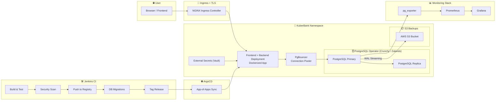

# 🏦 KuberBank - Cloud-Native Banking Platform

Kubernetes-native banking platform with GitOps featuring ArgoCD & Jenkins CI pipelines for automated deployments, high-availability PostgreSQL, monitoring with Prometheus & Grafana.
## 🚧 Project currently under development 🚧

---

## 🏗 Architecture Diagram (Simplified)


## 🌟 Features

### 🚀 Infrastructure
- **Kubernetes-Native**: Built entirely on Kubernetes with cloud-native principles
- **High Availability**: PostgreSQL cluster with 3 replicas and automatic failover
- **Auto-Scaling**: HPA/VPA for optimal resource utilization
- **Zero-Downtime Deployments**: Blue-green deployments via GitOps

### 🔄 GitOps & CI/CD
- **ArgoCD**: Automated GitOps workflow with app-of-apps pattern
- **Jenkins Pipeline**: Complete CI pipeline with testing, security scanning, and automated deployments
- **Auto-Sync**: Automatic deployment on git push
- **Rollback Support**: One-click rollback to previous versions

### 🗄️ Database
- **PostgreSQL Operator**: Managed HA PostgreSQL cluster with Patroni
- **PgBouncer**: Connection pooling to prevent database overload
- **Automated Backups**: Daily backups to S3 with PITR support
- **WAL Archiving**: Continuous archiving for disaster recovery
- **TLS Encryption**: End-to-end encryption for database connections

### 📊 Observability
- **Prometheus**: Metrics collection and alerting
- **Grafana**: Beautiful dashboards for monitoring
- **Loki**: Centralized logging
- **Custom Metrics**: Application and database metrics
- **Alert Rules**: Proactive monitoring with Slack integration

### 🔐 Security
- **External Secrets**: Vault integration for secret management
- **Network Policies**: Zero-trust networking with strict ingress/egress rules
- **TLS Everywhere**: Encrypted communication between all services
- **RBAC**: Role-based access control
- **Security Scanning**: Trivy and OWASP dependency checks in CI

## 📁 Project Structure

```
KuberBank/
├── app/                                # Frontend & Backend Application
│   ├── api/                            # Node.js Backend API
│   │   ├── jest.config.js              # Jest testing configuration
│   │   ├── jest.setup.js               # Test environment setup
│   │   ├── package.json                # Node.js dependencies and scripts
│   │   ├── server.js                   # Express.js server entry point
│   │   └── __test__/                   # Unit and integration tests
│   │       ├── api.test.js             # API endpoint tests
│   │       └── integration.test.js     # Database integration tests
│   ├── dashboard.css                   # Dashboard-specific styles
│   ├── Dockerfile                      # Container image definition
│   ├── img/...                         # Application images and icons
│   ├── index.html                      # Main HTML entry point
│   ├── sass/                           # Sass source files
│   │   ├── base.scss                   # Base styles and variables
│   │   ├── components.scss             # Reusable UI components
│   │   ├── layout.scss                 # Layout and grid system
│   │   └── main.scss                   # Main Sass entry point
│   ├── script.js                       # Frontend JavaScript logic
│   ├── style.css                       # Compiled CSS styles
│   └── style.css.map                   # CSS source maps
├── database/                           # Database schema and functions
│   ├── functions/
│   │   └── 001_banking_functions.sql   # PostgreSQL stored procedures
│   └── migrations/
│       └── 001_init_schema.sql         # Database schema migration
├── docs/                               # Project documentation
│   ├── database.md                     # Database architecture guide
│   ├── jankins_setup.txt               # Jenkins configuration (typo: should be jenkins_setup.txt)
│   └── testing.md                      # Testing strategy and guidelines
├── scripts/                            # Automation and utility scripts
│   ├── backup.sh                       # Database backup to S3
│   ├── init_db.sh                      # Database initialization
│   ├── restore.sh                      # Database restore from backup
│   └── run-tests.sh                    # Test runner with database setup
├── k8s/                                # Kubernetes manifests
│   ├── postgres/                       # Database cluster configuration
│   │   ├── postgresql-cluster.yaml     # PostgreSQL operator config
│   │   └── backup-cronjob.yaml         # S3 backup jobs
│   ├── backend/                        # Backend application deployment
│   │   ├── deployment.yaml             # Backend pod specification
│   │   ├── service.yaml                # Backend service definition
│   │   └── hpa.yaml                    # Horizontal Pod Autoscaler config
│   ├── frontend/                       # Frontend application deployment
│   │   └── deployment.yaml             # Frontend pod specification
│   ├── monitoring/                     # Observability stack
│   │   ├── prometheus-config.yaml      # Metrics collection configuration
│   │   ├── grafana-dashboards.yaml     # Monitoring dashboards
│   │   └── alertmanager.yaml           # Alerting rules and routing
│   ├── secrets/                        # Secret management
│   │   └── external-secrets.yaml       # Vault/External Secrets integration
│   └── network-policies/               # Security policies
│       └── policies.yaml               # Zero-trust network policies
├── argocd/                             # GitOps configuration
│   ├── app-of-apps.yaml                # ArgoCD ApplicationSet for managing all apps
│   └── applications/                   # Individual ArgoCD Application manifests
├── Jenkinsfile                         # CI/CD pipeline definition
├── LICENSE                             # Project license
└── README.md                           # Project overview and setup guide
```

## 🚀 Quick Start

### Prerequisites
- Kubernetes cluster (1.24+)
- kubectl configured
- Helm 3
- ArgoCD
- Jenkins (optional, for CI)
- Vault (for secrets management)

### 1. Install Operators

```bash
# Install PostgreSQL Operator
kubectl apply -k github.com/zalando/postgres-operator/manifests

# Install External Secrets Operator
helm repo add external-secrets https://charts.external-secrets.io
helm install external-secrets external-secrets/external-secrets -n external-secrets --create-namespace

# Install ArgoCD
kubectl create namespace argocd
kubectl apply -n argocd -f https://raw.githubusercontent.com/argoproj/argo-cd/stable/manifests/install.yaml
```

### 2. Setup Vault (Secrets)

```bash
# Initialize Vault
kubectl exec -it vault-0 -n vault -- vault operator init

# Unseal Vault and enable Kubernetes auth
kubectl exec -it vault-0 -n vault -- vault auth enable kubernetes

# Create secrets
vault kv put secret/kuberbank/postgres \
  username=bankuser \
  password= \
  host=kuberbank-postgres \
  port=5432 \
  database=kuberbank

vault kv put secret/kuberbank/s3-backup \
  access-key-id= \
  secret-access-key= \
  endpoint=https://s3.amazonaws.com \
  region=us-east-1
```

### 3. Deploy KuberBank

```bash
# Clone repository
git clone https://github.com/Hamza-XP/KuberBank.git
cd KuberBank

# Apply namespace
kubectl create namespace kuberbank
kubectl label namespace kuberbank name=kuberbank

# Deploy using ArgoCD
kubectl apply -f argocd/app-of-apps.yaml

# Watch deployment
kubectl get applications -n argocd
argocd app sync kuberbank-root --prune
```

### 4. Access Applications

```bash
# Get ArgoCD admin password
kubectl -n argocd get secret argocd-initial-admin-secret -o jsonpath="{.data.password}" | base64 -d

# Port forward ArgoCD
kubectl port-forward svc/argocd-server -n argocd 8080:443

# Port forward Grafana
kubectl port-forward svc/grafana -n monitoring 3000:3000

# Access KuberBank
kubectl port-forward svc/kuberbank-frontend -n kuberbank 8081:80
```

Access:
- **KuberBank UI**: http://localhost:8081
- **ArgoCD**: https://localhost:8080 (admin / <password>)
- **Grafana**: http://localhost:3000 (admin / admin)
- **Prometheus**: http://localhost:9090

## 🔧 Configuration

### PostgreSQL High Availability

The PostgreSQL cluster is configured with:
- **3 replicas** for high availability
- **Synchronous replication** for data safety
- **Automatic failover** via Patroni
- **PgBouncer** for connection pooling (100 max connections)
- **Daily backups** to S3 with 30-day retention
- **WAL archiving** for Point-in-Time Recovery

### Monitoring & Alerts

Pre-configured alerts:
- Database down
- High replication lag (>10s)
- High connection count (>180)
- Disk space low (>85%)
- WAL archiving failures
- Slow queries (>5s)
- High error rate in API
- Pod restart loops

### Network Security

Zero-trust network policies:
- Default deny all ingress/egress
- Backend can only access PostgreSQL/PgBouncer
- PostgreSQL only accessible from backend and pooler
- Monitoring has read-only access
- All external traffic through ingress controller

## 📊 API Endpoints

### Accounts
- `POST /api/accounts` - Create new account
- `GET /api/accounts/:accountNumber` - Get account details

### Transactions
- `POST /api/transactions` - Create transaction (deposit/withdrawal)
- `GET /api/accounts/:accountNumber/transactions` - Get transaction history

### Transfers
- `POST /api/transfers` - Transfer between accounts

### Health
- `GET /health` - Health check
- `GET /ready` - Readiness check
- `GET /metrics` - Prometheus metrics

## 🔄 CI/CD Pipeline

Jenkins pipeline stages:
1. **Checkout**: Clone repository
2. **Install Dependencies**: npm install
3. **Lint & Code Quality**: ESLint + SonarQube
4. **Unit Tests**: Jest with coverage
5. **Database Migration Test**: Test migrations on test DB
6. **Integration Tests**: API integration tests
7. **Build Docker Image**: Multi-stage Docker build
8. **Security Scan**: Trivy + OWASP dependency check
9. **Push Image**: Push to registry
10. **Apply Migrations**: Run on production DB
11. **Tag Release**: Git tag for versioning
12. **Update Manifests**: Update image tag in k8s manifests
13. **Deploy**: ArgoCD auto-syncs changes

## 💾 Backup & Recovery

### Automated Backups

```bash
# Backups run daily at 2 AM UTC via CronJob
kubectl get cronjob postgres-backup -n kuberbank

# Manual backup
kubectl create job --from=cronjob/postgres-backup manual-backup-$(date +%s) -n kuberbank
```

### Restore from Backup

```bash
# List available backups
kubectl exec -it postgres-backup-pod -n kuberbank -- /scripts/list-backups.sh

# Restore specific backup
kubectl set env job/postgres-restore RESTORE_FILE=kuberbank_backup_20250120_020000.sql.gz -n kuberbank
kubectl create job --from=job/postgres-restore restore-$(date +%s) -n kuberbank
```

### Point-in-Time Recovery (PITR)

```bash
# Restore to specific timestamp
kubectl set env job/postgres-pitr RECOVERY_TARGET_TIME="2025-01-20 10:30:00" -n kuberbank
kubectl create job --from=job/postgres-pitr pitr-$(date +%s) -n kuberbank
```

## 📈 Monitoring Dashboards

Grafana dashboards included:
- **KuberBank Overview**: Application metrics, request rate, error rate, response times
- **PostgreSQL Performance**: Connections, transactions/sec, cache hit ratio, replication lag
- **Kubernetes Cluster**: Node resources, pod status, network traffic
- **Database Queries**: Slow queries, most frequent queries, query performance

## 🔐 Secret Rotation

Secrets are automatically rotated:
- **JWT tokens**: Every 6 hours
- **Database passwords**: Every 24 hours (via PushSecret)
- **TLS certificates**: Every 24 hours
- **S3 credentials**: Every 1 hour

## 🧪 Testing

```bash
# Run unit tests
cd app/api
npm test

# Run integration tests
npm run test:integration

# Run smoke tests
cd tests/smoke
npm run smoke-test
```

## 📝 Development

### Local Development

```bash
# Start PostgreSQL locally
docker-compose up -d postgres

# Run migrations
psql -h localhost -U bankuser -d kuberbank -f db/migrations/001_init.sql

# Start backend
cd app/api
npm install
npm run dev

# Start frontend
cd app
python -m http.server 8000
```

### Adding New Features

1. Create feature branch
2. Implement changes
3. Write tests
4. Push to GitHub
5. Jenkins runs CI pipeline
6. On merge to main, ArgoCD auto-deploys

## 🤝 Contributing

1. Fork the repository
2. Create your feature branch (`git checkout -b feature/amazing-feature`)
3. Commit your changes (`git commit -m 'Add amazing feature'`)
4. Push to the branch (`git push origin feature/amazing-feature`)
5. Open a Pull Request

## 📄 License

This project is licensed under the MIT License - see LICENSE file for details.

## 🗺️ Roadmap

- [ ] Multi-region deployment
- [ ] Service mesh integration (Istio)
- [ ] Advanced fraud detection
- [ ] Mobile app
- [ ] GraphQL API
- [ ] Kafka event streaming
- [ ] Machine learning for transaction categorization

---

**Built by Hamza Qureshi | 2025**

*When Kubernetes meets Banking* 🚀